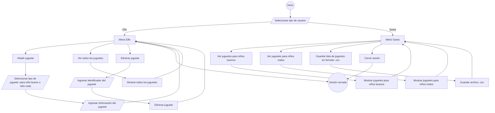
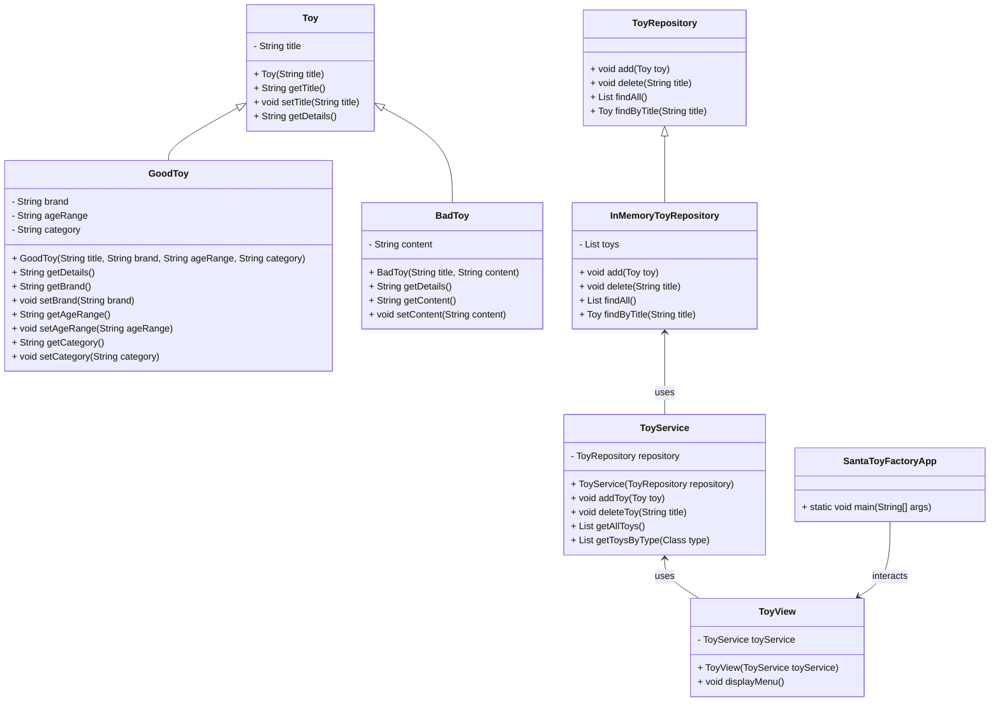

# Project in dev

# SantaIsComing-ToyFactory
Santa Toy Factory is a console-based application for managing toy inventory, designed using the MVC (Model-View-Controller) architecture. It helps Santa's elves to register, view, and delete toys, while Santa can review toy lists and export them as CSV files.
## Features

### For Elves:
1. **Add toys:**
   - Toys for good children (including title, brand, age range, and category).
   - Toys for naughty children (including title and content).
2. **View all toys.**
3. **Delete toys from the inventory.**
4. **Log out of the session.**

### For Santa:
1. **View a list of toys for good children.**
2. **View a list of toys for naughty children.**
3. **Save the list of all toys as a CSV file.**
4. **Log out of the session.**

## Project Structure

## Activity diagram

## Classes diagram

