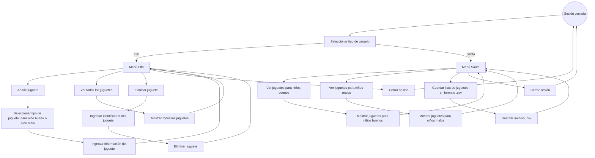

# -SantaIsComing-ToyFactory

```mermaid
flowchart TD
    A((Inicio)) --> B[Seleccionar tipo de usuario]
    B -->|Elfo| C[Menú Elfo]
    B -->|Santa| D[Menú Santa]

    %% Bloque para Elfo
    C --> E[Añadir juguete]
    C --> F[Ver todos los juguetes]
    C --> G[Eliminar juguete]
    C --> H[Cerrar sesión]

    E --> E1[Seleccionar tipo de juguete: para niño bueno o niño malo]
    E1 --> E2[Ingresar información del juguete]
    E2 --> C

    F --> F1[Mostrar todos los juguetes]
    F1 --> C

    G --> G1[Ingresar identificador del juguete]
    G1 --> G2[Eliminar juguete]
    G2 --> C

    H --> A[Sesión cerrada]

    %% Bloque para Santa
    D --> I[Ver juguetes para niños buenos]
    D --> J[Ver juguetes para niños malos]
    D --> K[Guardar lista de juguetes en formato .csv]
    D --> L[Cerrar sesión]

    I --> I1[Mostrar juguetes para niños buenos]
    I1 --> D

    J --> J1[Mostrar juguetes para niños malos]
    J1 --> D

    K --> K1[Guardar archivo .csv]
    K1 --> D

    L --> A((Sesión cerrada))

```
