# SantaIsComingToyFactory

## 🎅 Project Description
SantaIsComingToyFactory is a console application designed to manage the creation and storage of toys in Santa Claus's factory. This system allows elves to add, view, and delete toys, while Santa can oversee the toy lists and export them to a CSV file.

## 🛠️ Key Features
- **Toy Management**:
  - Elves can add good and bad toys to the inventory.
  - View all toys in the inventory.
  - Remove defective or unwanted toys.
- **Exclusive Features for Santa Claus**:
  - Check lists of toys for good and bad children.
  - Save the complete inventory to a CSV file.
- **MVC Architecture**:
  - Implementation of the Model-View-Controller architectural pattern.
  - Use of the Repository pattern for data persistence.
    
## Prerequisites

To run this project, you need to have the following installed:

- [Java Development Kit (JDK)](https://www.oracle.com/java/technologies/javase-downloads.html) (version 11 or higher).
- [JUnit](https://junit.org/junit5/) for running tests.
- [Hamcrest](http://hamcrest.org/JavaHamcrest/) for flexible assertions in tests.
- [Maven](https://maven.apache.org/) for dependency management and build tasks.
- [Jira](https://www.atlassian.com/software/jira) for management.

## 🚀 Installation
1. Clone this repository:
   ```bash
   git clone https://github.com/OlenaMyroshnykova/SantaIsComingToyFactory.git

## Project Structure

   src/main/java:
   controllers: Controllers managing system logic.
   models: Classes representing good and bad toys.
   views: User interaction via the console.
   repository: Management of data persistence.
   db: Simulated databases for toys.
   singletons: Singleton management for database instances.
   src/test/java:

   
Unit tests to verify functionality across different system components.
📖 Usage Example
Elf
-----------------------------------------
Toy Manager (Session Type: Elf)
1. Add toy
2. View all toys
3. Remove toy
4. Log out
Select an option: 1
-----------------------------------------
For a child...:
1. Good
2. Bad
Select an option: 1
Enter the title: LEGO City
Enter the brand: LEGO
Enter the recommended age: 8
Enter the category: Construction
Toy added successfully.


Santa Claus

-----------------------------------------
Toy Manager (Session Type: Santa Claus)
1. View list of toys for good children
2. View list of toys for bad children
3. Save the full toy list to CSV
4. Log out
Select an option: 3
List saved successfully to Toys.csv.

## Activity diagram

```mermaid
flowchart TD
    A((Inicio)) --> B[/Seleccionar tipo de usuario/]
    B -->|Elfo| C[Menú Elfo]
    B -->|Santa| D[Menú Santa]

    %% Bloque para Elfo
    C --> E[Añadir juguete]
    C --> F[Ver todos los juguetes]
    C --> G[Eliminar juguete]
    C --> H[Cerrar sesión]

    E --> E1[/Seleccionar tipo de juguete: para niño bueno o niño malo/]
    E1 --> E2[/Ingresar información del juguete/]
    E2 --> C

    F --> F1[Mostrar todos los juguetes]
    F1 --> C

    G --> G1[/Ingresar identificador del juguete/]
    G1 --> G2[Eliminar juguete]
    G2 --> C

    H((Sesión cerrada))

    %% Bloque para Santa
    D --> I[Ver juguetes para niños buenos]
    D --> J[Ver juguetes para niños malos]
    D --> K[Guardar lista de juguetes en formato .csv]
    D --> L[Cerrar sesión]

    I --> I1[Mostrar juguetes para niños buenos]
    I1 --> D

    J --> J1[Mostrar juguetes para niños malos]
    J1 --> D

    K --> K1[Guardar archivo .csv]
    K1 --> D

    L --> H

```



## Classes diagram


